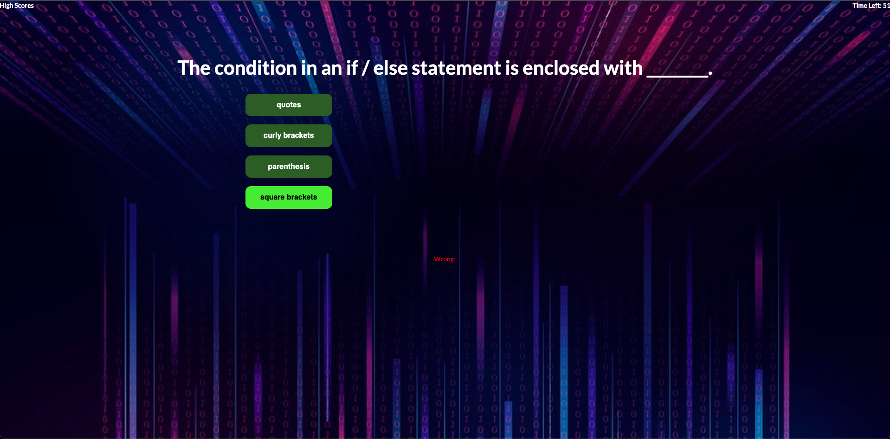
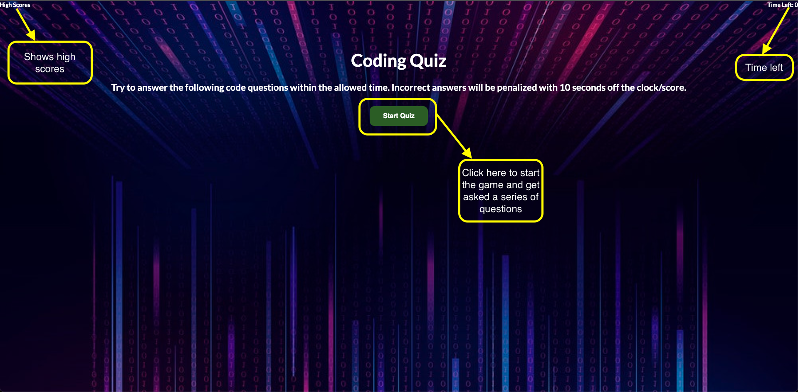

# About The Project:

A coding quiz to test your abilities about the JavaScrip language. It has as method of keeping high score persistently over refreshes and the highscore is based on time left after answering all the questions. If you pick a wrong answer 10 seconds will be taken off the clock.

# Built With:

- HTML
- CSS
- JavaScript

# Getting Started

In order to run this project you need to click on this link: https://benjamind10.github.io/code-assessment/

# Demo

## 

# How To Use App:

## 
